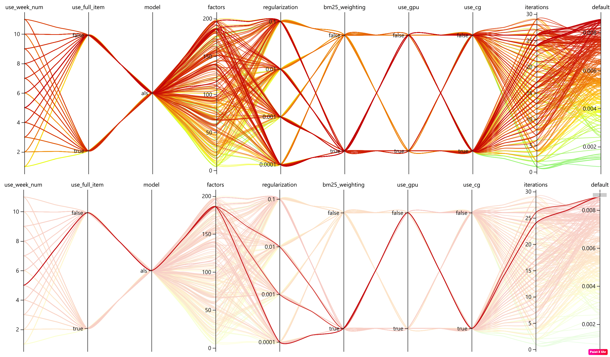
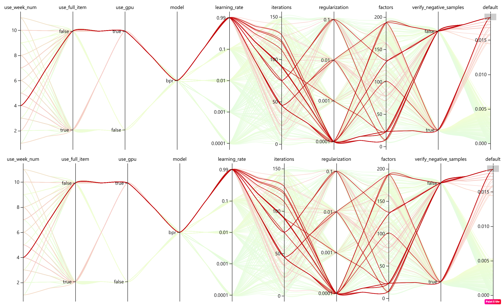
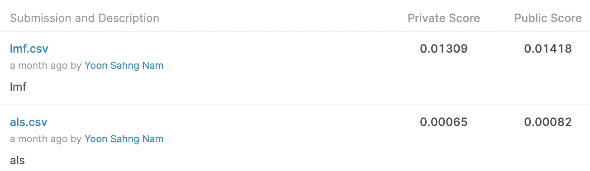

# Implicit on H&M

## How to Run

```bash
$ nnictl create --config nni_config_{modelname}
```

## result
- [Kaggle Repo ALS](https://www.kaggle.com/code/julian3833/h-m-implicit-als-model-0-014/)
    - private: 0.01391
    - public: 0.01405

- Validation(last 1 week) HPO
    - ALS
        -  
    - BPR
        -  
    - LMF
        -  
- on Test
    -  

## References
- ALS
    - code : https://github.com/benfred/implicit/blob/main/implicit/als.py, https://github.com/benfred/implicit/blob/main/implicit/cpu/als.py
- BPR:
    - paper: https://arxiv.org/pdf/1205.2618.pdf
    - code : https://github.com/benfred/implicit/blob/main/implicit/bpr.py, https://github.com/benfred/implicit/blob/main/implicit/cpu/bpr.pyx
- LMF:
    - paper: https://web.stanford.edu/~rezab/nips2014workshop/submits/logmat.pdf
    - code : https://github.com/benfred/implicit/blob/main/implicit/lmf.py, https://github.com/benfred/implicit/blob/main/implicit/cpu/lmf.pyx

- https://github.com/benfred/implicit/tree/main/examples
- https://www.kaggle.com/code/julian3833/h-m-implicit-als-model-0-014/
